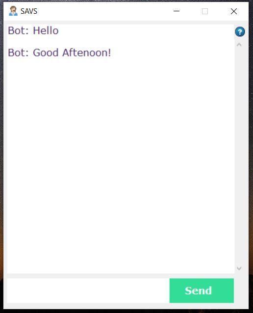
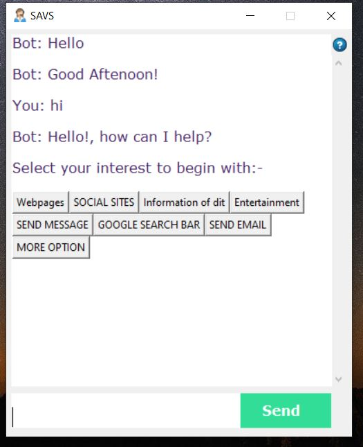
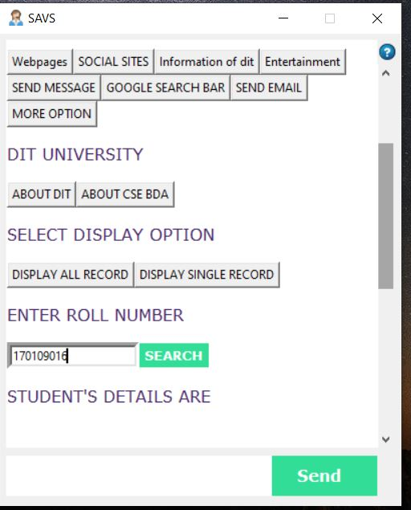
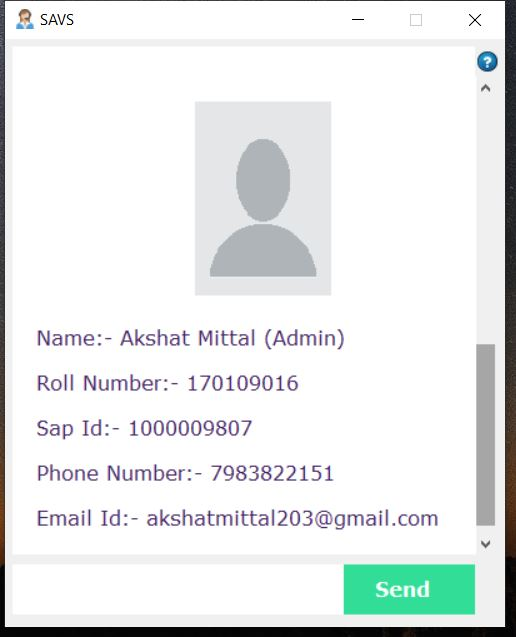
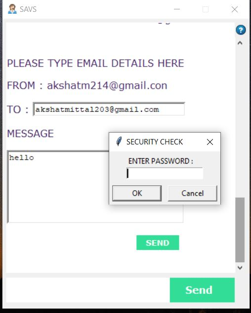
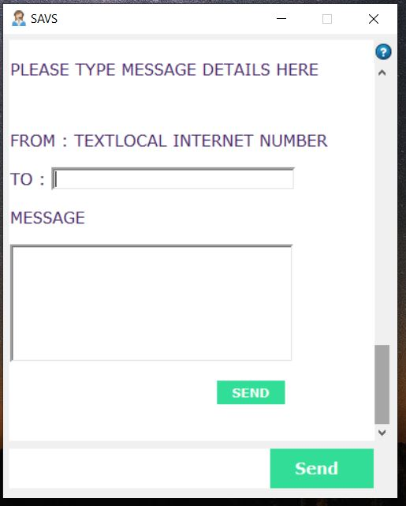
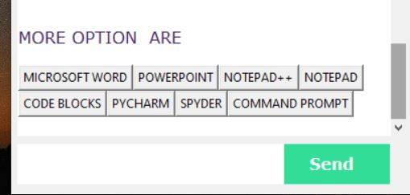
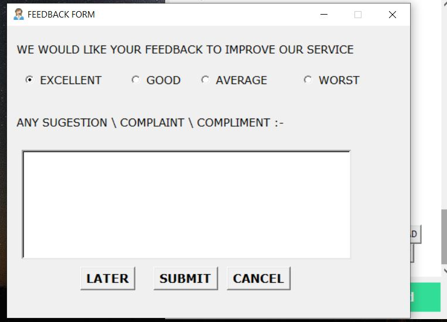
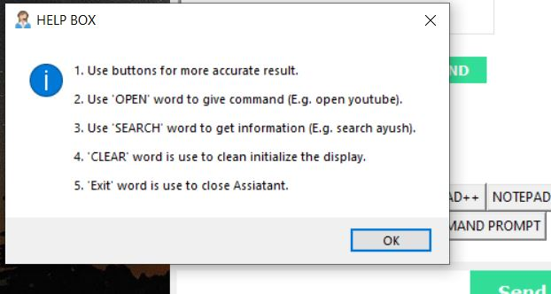

# chatbot-using-AI

PROJECT GUI

AFTER ONE REPLY CHATBOT GIVE SOME SUGGESTION

THIS IS USED FOR GET A INFORMATION OF EMPLOYEE 

IN THIS WE SEND A MAIL USING THIS PROJECT

ALSO SEND A MESSAGES FROM TEXT BULK ACCOUNT

AND ALSO ADD MANY OTHER OPTIONS

ALSO ADD A FEEDBACK FORM THAT HELP TO IMPROVE USER EXPERIENCE

ALSO ADD HELP BOX THAT GUIDE A NEW USER HOW TO USE IT

